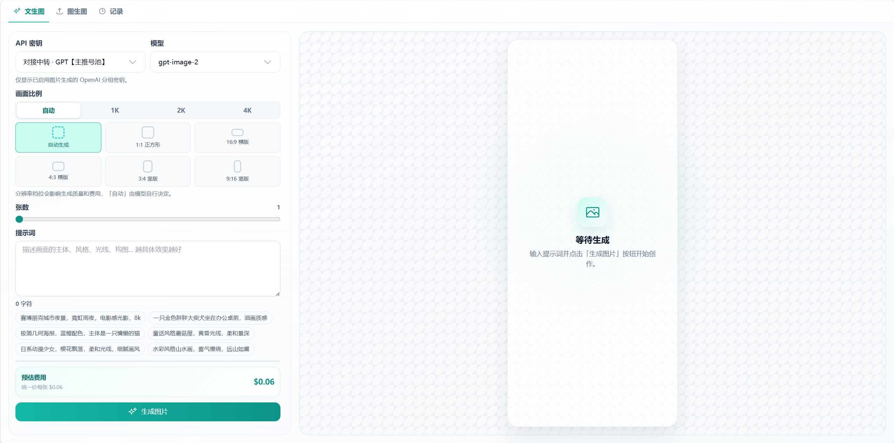
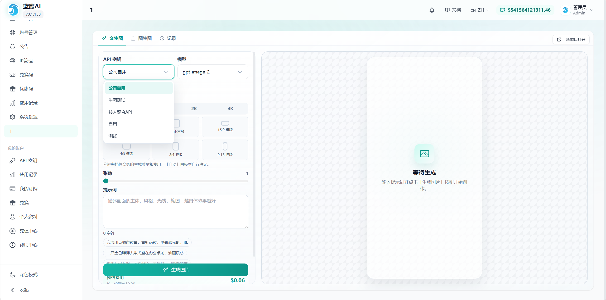

<div align="center">

# 蓝鹰AI - 在线图片生成


> 专为 [sub2api](https://github.com/Wei-Shaw/sub2api) 项目打造的 iframe 嵌入式 AI 图片生成工具  
> 无需配置，嵌入即用

[在线演示](https://text.ahg.codes/) · [报告问题](https://github.com/Wei-Shaw/sub2api/issues) · [相关项目](https://github.com/Wei-Shaw/sub2api)

</div>

---

## 目录

- [项目简介](#项目简介)
- [界面展示](#界面展示)
- [功能特性](#功能特性)
- [技术架构](#技术架构)
- [使用方法](#使用方法)
- [项目结构](#项目结构)
- [工作原理](#工作原理)
- [支持的模型](#支持的模型)
- [许可证](#许可证)

---

## 项目简介

本项目是一个轻量级的 AI 图片生成前端页面，专门为 sub2api 项目设计，通过 iframe 嵌入方式集成到 sub2api 后台，实现无缝使用 OpenAI 图片生成功能。

---

## 界面展示

### 主页面



### 嵌入到 sub2api 的样式



---

## 功能特性

| 功能 | 说明 |
|:-----|:-----|
| **文生图** | 输入描述性提示词，AI 自动生成对应图片 |
| **图生图** | 上传参考图，基于参考图进行二次创作 |
| **多种分辨率** | 支持 1:1、16:9、4:3、3:4、9:16 等画面比例 |
| **多档质量** | 支持自动、低、中、高质量选择 |
| **批量生成** | 单次可生成 1-5 张图片 |
| **历史记录** | 自动保存最近 30 条生成记录 |
| **费用预估** | 实时显示生成费用 |

---

## 技术架构

```
┌─────────────────────────────────────────────────────────┐
│                      浏览器前端                          │
├─────────────────────────────────────────────────────────┤
│  HTML5  │    CSS3     │    JavaScript (原生)             │
├─────────────────────────────────────────────────────────┤
│                  iframe 通信协议                         │
├─────────────────────────────────────────────────────────┤
│                    sub2api 后台                          │
└─────────────────────────────────────────────────────────┘
```

- **纯前端实现**：HTML + CSS + JavaScript，无任何外部依赖
- **开箱即用**：无需安装，直接部署即可使用
- **无缝集成**：完美适配 sub2api 的 iframe 通信协议

---

## 使用方法

### 方式一：嵌入到 sub2api（推荐）

在 sub2api 后台的 **iframe 设置** 页面，添加以下地址：

```
https://text.ahg.codes
```

保存后即可在后台直接使用图片生成功能。

### 方式二：本地部署

将项目文件部署到任意静态服务器：

```bash
# 使用 Node.js 的 http-server
npx http-server -p 8080

# 或使用 Python
python -m http.server 8080

# 或使用 PHP
php -S localhost:8080
```

---

## 项目结构

```
.
├── index.html      # 主页面
├── main.js         # 核心逻辑
├── styles.css      # 样式文件
├── img/
│   ├── 1.png       # 主页面截图
│   └── 2.png       # 嵌入样式截图
└── loog.png        # Logo 图标
```

---

## 工作原理

本页面通过 URL 参数从 sub2api 获取认证信息：

| 参数 | 说明 |
|:-----|:-----|
| `token` | 用户认证令牌 |
| `src_host` | sub2api 服务地址 |
| `user_id` | 用户 ID |
| `ui_mode` | 界面模式（embedded） |

页面加载后会自动调用 sub2api 的 `/api/v1/keys` 接口获取可用的 API 密钥列表，用户选择密钥后即可开始生成图片。

---

## 支持的模型

| 模型 | 状态 | 说明 |
|:-----|:----:|:-----|
| `gpt-image-2` | 推荐 | 最新模型，效果最佳 |
| `gpt-image-1.5` | 稳定 | 稳定版本，兼容性好 |
| `gpt-image-1` | 基础 | 早期版本，基础功能 |

---

## 相关项目

- [sub2api](https://github.com/Wei-Shaw/sub2api) - API 密钥管理与中转服务

---

<div align="center">

## 许可证

MIT License

Copyright (c) 2024 蓝鹰AI


</div>
